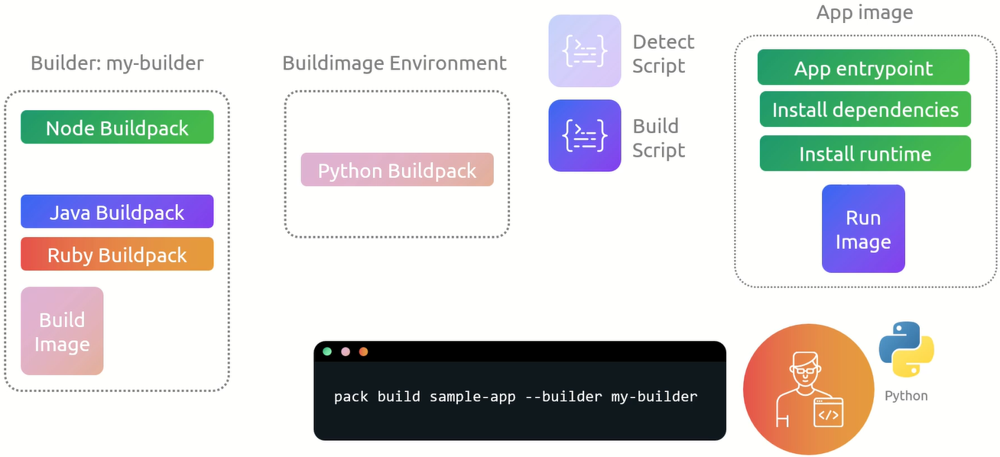

# Cloud Native Buildpacks

Cloud Native Buildpacks transform your application source code into container images. They provide a higher-level abstraction for building container images compared to Dockerfiles. Buildpacks detect the language and framework used in your application, install dependencies, compile the code, and package it into a container image. This process ensures consistency, security, and efficiency in building and deploying applications.



## Build Process Summary

This diagram explains the process of building an application image using a builder (in this case, `my-builder`) and its associated buildpacks. Here's a summary:

### Builder (my-builder)

Contains multiple buildpacks (e.g., Node, Java, Ruby, and Python) and a build image that provides the environment to construct the application.

### Build Process

1. **Detection**: A detect script determines which buildpack is suitable for the application.
2. **Build**: A build script executes, installing dependencies, setting up runtimes, and preparing the app for execution.

### App Image

- Includes the app's entry point, installed dependencies, and runtime environment.
- Uses a base "Run Image" to execute the application.

### Command

The command `pack build sample-app --builder my-builder` triggers the process, which combines the builder environment and app requirements to create the final runnable app image.

### Pack CLI Commands

Here are some useful `pack` CLI commands:

1. `pack --version`: Displays the installed version of the `pack` CLI.
2. `pack builder suggest`: Lists recommended builder images.
3. `pack builder inspect <builder-image>`: Provides detailed information about the specified builder image. Replace `<builder-image>` with the name of the builder image you want to inspect.
4. `pack inspect <image>`: Provides detailed information about the specified image. Replace `<image>` with the name of the image you want to inspect.

    The differences between `pack inspect <image>` and `pack builder inspect <builder-image>` are shown below:
    
    - `pack inspect <image>`: This command provides detailed information about a specific application image. It includes metadata such as the base image, layers, and environment variables.
    - `pack builder inspect <builder-image>`: This command provides detailed information about a specific builder image. It includes metadata such as the buildpacks included, the stack used, and the lifecycle version.
5. `pack --help`: Displays help information for the `pack` CLI and its commands.
6. `pack build <image-name> --path <source-path> --builder <builder-image> --publish`: Builds an application image using the specified builder image and source code path, and publishes it to a registry. Replace `<image-name>` with the desired name for the image, `<source-path>` with the path to the source code, and `<builder-image>` with the name of the builder image.
7. `pack rebase <image-name> --run-image <run-image>`: Rebases the specified application image with a new run image. Replace `<image-name>` with the name of the application image and `<run-image>` with the name of the new run image.

    Example usage:

    ```sh
    pack rebase my-image --run-image run-base:v2
    ```
    This command updates the base image of `my-image` to `run-base:v2` without rebuilding the entire application. It is useful for applying security patches or updates to the base image.
8. `pack buildpack new <buildpack-name> --api <api-version> --path <path> --version <version>`: Creates a new buildpack with the specified name, API version, path, and version. Replace `<buildpack-name>` with the desired name for the buildpack, `<api-version>` with the API version, `<path>` with the path where the buildpack will be created, and `<version>` with the version of the buildpack.

    Example usage:
    ```sh
    pack buildpack new my-js-buildpack --api 0.10 --path js-buildpack --version 0.0.1
    ```

    This command creates a new buildpack named `my-js-buildpack` with API version `0.10`, located at `js-buildpack`, and version `0.0.1`.

9. `pack buildpack package <buildpack-name> --config <config-path>`: Packages a buildpack into a tarball or OCI image using the specified configuration file. Replace `<buildpack-name>` with the name of the buildpack and `<config-path>` with the path to the configuration file.

    Example usage:
    ```sh
    pack buildpack package my-js-buildpack --config ./package.toml
    ```

    This command packages the `my-js-buildpack` buildpack using the configuration specified in `./package.toml`.

10. `pack builder create <builder-name> --config <config-path>`: Creates a new builder image using the specified configuration file. Replace `<builder-name>` with the name of the builder and `<config-path>` with the path to the configuration file.

    Example usage:
    ```sh
    pack builder create my-builder --config ./builder.toml
    ```

    This command creates a new builder image named `my-builder` using the configuration specified in `./builder.toml`.

### Project Descriptor (project.toml)

The `project.toml` file is used to provide metadata about your project and configure the build process. Here are some common sections and fields:

- `[project]`: Contains general information about the project.
  - `id`: A unique identifier for the project.
  - `name`: The name of the project.
  - `version`: The version of the project.
  - `description`: A brief description of the project.

- `[build]`: Contains build-related configuration.
  - `builder`: The builder image to use for building the project.
  - `buildpacks`: A list of buildpacks to use for building the project.
  - `include`: A list of files or directories to include in the build context.
  - `exclude`: A list of files or directories to exclude from the build context.

- Example `project.toml`:

    ```toml
    [_]
    schema-version = "0.2"
    id = "io.buildpacks.node-app"
    name = "node app"
    version = "1.0.0"

    [io.buildpacks]
    builder = "gcr.io/buildpacks/builder:google-22"
    exclude = [
        ".env"
    ]
    ```
    ```bash
    pack build <image-name> --path <source-path>
    ```
